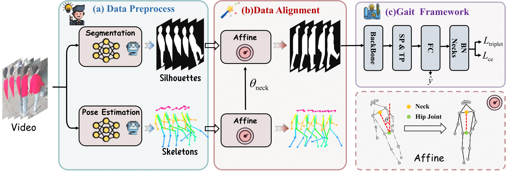

<div align="center">
<hr>
<font size="6"><i><b>DAGait: Generalized Skeleton-Guided Data Alignment for Gait Recognition</b></i></font>
<br><br>
<a href='https://arxiv.org/pdf/2503.18830'></a>
&nbsp;
<a href='https://dingwu1021.github.io/DAGait/'></a>
<br><br>
<i>Zhengxian Wu*, Chuanrui Zhang*, Hangrui Xu, Peng Jiao, Haoqian Wang†</i>
</div>




## 🔆 News
🔥🔥 (2025.03) Paper is available on arXiv: [DAGait: Generalized Skeleton-Guided Data Alignment for Gait Recognition](https://arxiv.org/pdf/2503.18830)

🔥🔥 (2025.03) This paper has been accepted to **ICME 2025**.

## 👀 Abstract
Gait recognition is emerging as a promising and innovative area within the field of computer vision, widely applied to remote person identification. Although existing gait recognition methods have achieved substantial success in controlled labora tory datasets, their performance often declines significantly when transitioning to wild datasets. We argue that the performance gap can be primarily attributed to the spatio-temporal distribution inconsistencies present in wild datasets, where subjects appear at varying angles, positions, and distances across the frames. To achieve accurate gait recognition in the wild, we propose a skeleton-guided silhouette alignment strategy, which uses prior knowledge of the skeletons to perform affine transformations on the corresponding silhouettes. To the best of our knowledge, this is the first study to explore the impact of data alignment on gait recognition. We conducted extensive experiments across multiple datasets and network architectures, and the results demonstrate the significant advantages of our proposed align ment strategy. Specifically, on the challenging Gait3D dataset, our method achieved an average performance improvement of 7.9% across all evaluated networks. Furthermore, our method achieves substantial improvements on cross-domain datasets, with accuracy improvements of up to 24.0%.

## ⚙️ Setup

### Install Environment via Anaconda (Recommended)
```bash
conda create -n dagait python=3.9.0
conda activate dagait
pip install -r requirements.txt
```


### 💫 Generate training data
#### 1. Generate aligned silhouette images
You need to change the skeleton path, silhouette path, output path, and log path to your desired locations.
```bash
transform.sh
```
#### 2. Convert images to .pkl files

The silhouette path here should point to the **aligned images**.

```bash
pkl_process.sh
```

#### 3. Training
You can use the aligned pkl files to train various gait recognition networks.

```bash
CUDA_VISIBLE_DEVICES=0,1 python -m torch.distributed.launch --nproc_per_node=2 opengait/main.py --cfgs ./configs/baseline/baseline.yaml --phase train
```
For dataset samples without provided skeletons, we use [**SAPIENS**](https://github.com/facebookresearch/sapiens) to generate the corresponding skeletons from the images.

## 📜 License

This repository is released under the Apache 2.0 license.


## 😉 Citation
Please consider citing our paper if our code are useful:
```bib
@article{wu2025dagait,
      title={DAGait: Generalized Skeleton-Guided Data Alignment for Gait Recognition}, 
      author={Zhengxian Wu and Chuanrui Zhang and Hangrui Xu and Peng Jiao and Haoqian Wang},
      journal={arXiv preprint arXiv:2503.18830},
      year={2025}
}
```


## 🙏 Acknowledgements
- The codebase is based on [OpenGait](https://github.com/ShiqiYu/OpenGait)